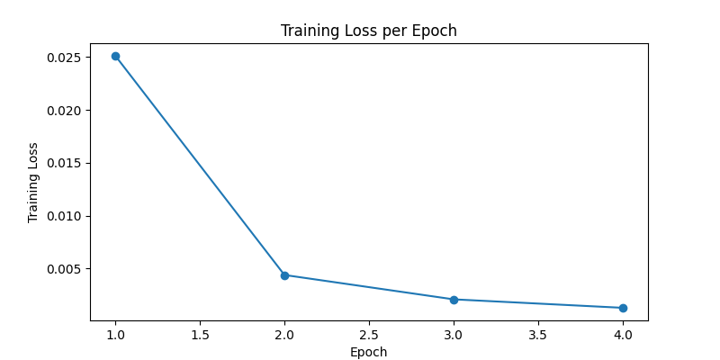
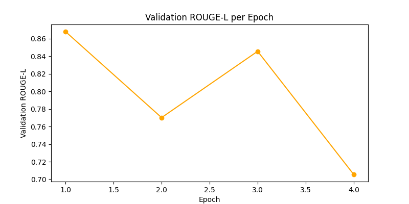

# Daily Mail Summarization Project

## Overview

This project uses the **Daily Mail Summarization Dataset** to train a BART-based transformer model for text summarization. The model takes news articles as input and generates concise summaries.

## Dataset

- **Source:** [Kaggle Daily Mail Summarization Dataset](https://www.kaggle.com/datasets/evilspirit05/daily-mail-summarization-dataset)
- **Format:** CSV with columns:
  - `URL`: URL of the original article
  - `article`: Full text of the article
  - `highlights`: Summary of the article
- **Samples after cleaning:** 8,165
- **Average article length:** 44.8 tokens
- **Average summary length:** 23.1 tokens

## Model

- **Architecture:** BART (Transformer-based seq2seq)
- **Framework:** Hugging Face Transformers
- **Training Configuration:**
  - Batch size: 8 (with gradient accumulation 2 → effective batch 16)
  - Learning rate: 2e-5
  - Weight decay: 0.01
  - Epochs: 4
  - Mixed precision (fp16) enabled
  - Validation subset: 100 samples (to reduce GPU memory usage)

## Training Results

### Average Training Loss per Epoch

### Validation ROUGE-L per Epoch

| Epoch | Average Training Loss | Validation ROUGE-L |
| ----- | --------------------- | ------------------ |
| 1     | 0.0251                | 0.8681             |
| 2     | 0.0044                | 0.7702             |
| 3     | 0.0021                | 0.8457             |
| 4     | 0.0013                | 0.7055             |

**Best Model:** Epoch 1 with ROUGE-L = 0.8681, saved to `./best_bart_summarizer/best_model`

## Evaluation Metrics

- **ROUGE-1, ROUGE-2, ROUGE-L** computed on validation subset using the `rouge_score` library.
- Average ROUGE-L achieved during training: 0.8681

## Notes

- Validation is performed on a small subset (100 samples) due to GPU memory constraints.
- Plots reflect **average training loss per epoch** and **ROUGE-L performance**.
- Model is optimized for **concise summarization**.

# IMPORTANT

Only use the code using git clone because an important model.safetensor file is in git LFS.
